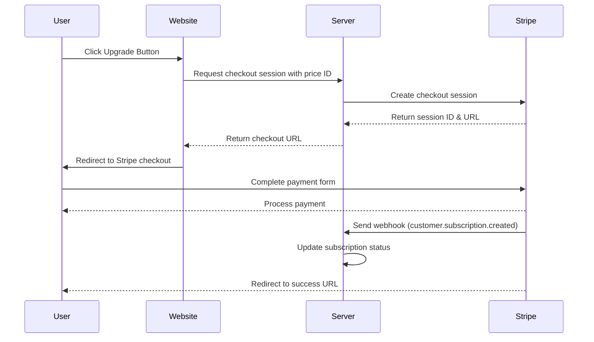

Last week I launched [ConvoCards](https://convo.cards), a conversation starter card game app. Here's the story behind it, what I was aiming for, and what I learned along the way.

I'm really happy with the response. Seeing those first user signups and Stripe payments come in was very exciting. A big thank you to everyone who tried out the app, and especially to those who paid for the premium version!

While I've put out a number of free apps and code before, this is my first time taking something all the way to a "complete" product including a landing page, tutorial, and paid tier.

## The Idea

The idea started with a pack of physical conversation starter cards my partner and I picked up during a California road trip. We had a lot of fun using them on the trip and over dinner, but eventually burned through all 50 questions. I thought it would be a fun idea to make a digital version with way more questions and different themes to choose from.

I wanted to keep things super simple this time: take the most straightforward idea possible and get it over the finish line. My goals were to make an app that I wanted to play, that others would find useful, and to learn a few new things like Stripe payments and how to make a landing page.

## Research

The first thing I do before starting any project is to research existing solutions. I want to find out: What's out there? What works? What's missing? Is this viable? I used the AI app [Perplexity](https://www.perplexity.ai) to run a competitor analysis. Previously, manually searching the web and comparing existing products would have been time-consuming, but Perplexity was able to do this really well in a single search. I asked it to compile a list of existing products, their price ranges, estimated popularity, unique features, etc.


The results were promising. There were successful apps out there showing there's a market, but no single app dominated the space. I had some ideas for additional features as well. Another thing I noticed was that existing products were all mobile apps. I couldn't find a good web version. While mobile apps have their advantages, I thought a web version you could access on mobile and desktop browsers might be more accessible.

## Project Management

I use [Logseq](https://logseq.com) to manage all the tasks and research related to the project. I have a tendency to get off track working on unessential things, so I use Logseq to keep me focused and moving forward. I spent time thinking about each task that needed to be done and wrote them down ahead of time, before starting coding.


I'm using the new Logseq DB version which has a more powerful system for tagging data in your notes. I used the outliner on the daily journal to write down tasks, research, and timestamped logs of what I was doing.

The new Logseq DB features allow me to collect all the tasks related to project throughout my notes in one place. I really like this feature because I'm often researching, brainstorming, and writing down ideas in the daily notes view and I like to maintain a lot of context about where the idea came from, and still manage all the related tasks in one place.


## Building

### Next.js


Next.js is a web framework that makes it easier to build frontend apps with server side logic, like loading and updating data.
I like the framework a lot but hadn't used for anything this interactive before. I ran into some weirdness with Next.js, like figuring out what to do client side vs server side, cache revalidation, when to use form actions vs client side server actions, and handling updates mid animation. But overall it simplified many things, like handling database updates through server actions and setting up Stripe webhook endpoints.

I used the [NextAuth](https://next-auth.js.org) library to handle authentication with Google OAuth.

This integrates nicely with Next.js and makes it easy to check if the user is logged in, redirect them if not, and fetch their data.

I used [server actions](https://nextjs.org/docs/app/building-your-application/data-fetching/server-actions) to update data, such as marking a card as a favorite.

Here’s an example of rendering a page, checking if the user is logged in, and fetching the database for the logged-in user's favorites.

```tsx
export default async function FavoritesList() {
  // Get the authenticated session
  const session = await getServerSession(authOptions);

  // Redirect if not logged in
  if (!session?.user?.id) {
    redirect("/login");
  }

  // Fetch favorites for the current user
  const favorites = await prisma.favorite.findMany({
    where: {
      userId: session.user.id,
    },
    include: {
      card: true,
    },
    orderBy: {
      createdAt: "desc",
    },
  });

  return (
    <div className="max-w-2xl mx-auto p-6">
      <h1 className="text-2xl font-bold mb-6">Your Recent Favorites</h1>

      {favorites.length === 0 ? (
        <p className="text-gray-500">You haven't favorited any cards yet.</p>
      ) : (
        <div className="space-y-4">
          {favorites.map((favorite) => (
            <div key={favorite.id} className="border rounded-lg p-4 hover:bg-gray-50">
              <h2 className="font-medium">{favorite.card.question}</h2>
              <p className="text-sm text-gray-500">
                Favorited on {new Date(favorite.createdAt).toLocaleDateString()}
              </p>
            </div>
          ))}
        </div>
      )}
    </div>
  );
}
```

### Tailwind

Tailwind is a CSS framework that simplifies styling web apps. I used it for the layout and styling in all my projects.

I've written CSS using many different styles, but I like [Tailwind](https://tailwindcss.com/) the most for its ease of use and modularity. Sometimes it gets verbose, but it helps me avoid pitfalls that come from plain CSS.


### Framer Motion

For animations, I used the [Framer Motion](https://motion.dev) library in React. After trying out a bunch of different libraries, Framer seems most powerful and easy to use.

I haven't done much with web animations before, but Framer made it straightforward and fun. I'm excited to dig deeper and see what other cool stuff I can make with it.

Here's how you would make an animated arrow bounce back and forth.

```tsx
<motion.div animate={{ x: [0, 10, 0] }} transition={{ repeat: Infinity, duration: 1.5 }}>
  <ArrowRight className="mx-auto opacity-80" size={48} />
</motion.div>
```

### Prisma

I use [Prisma](https://www.prisma.io) along with Postgres to handle database operations.
Prisma has some quirks, but it's my favorite ORM overall. The queries are flexible, type-safe, and it auto-generates migration files when you update your schema. These migrations are really helpful when moving fast with data model changes. Not all ORMs can handle this. On the downside, it has suboptimal performance for some relational queries, but there's a [feature in beta](https://github.com/prisma/prisma/discussions/22288) to improve this.

I considered DynamoDB and some Cloudflare data solutions as well, but decided to stick with open-source tech to avoid getting locked into any particular vendor.

Here's an example of the Prisma schema for cards and packs. This is all you need to generate the database tables, types, client, and migrations.

```prisma
model Pack {
  id          String   @id @default(cuid())
  name        String
  description String
  packType    PackType @default(FREE)
  icon        String   @default("💰")
  color       String   @default("#000000")
  bgColor     String   @default("#ffffff")
  cards       Card[]
  users       User[]
}

model Card {
  id        String     @id @default(cuid())
  question  String
  packId    String
  pack      Pack       @relation(fields: [packId], references: [id])
  favorites Favorite[]
  seenBy    SeenCard[]
}
```

Fetching a pack with its cards:

```ts
const pack = await prisma.pack.findUnique({
  where: { id: "123" },
  include: {
    cards: true,
  },
});
```

### Stripe

This was my first time using Stripe Checkout. Getting everything set up (subscriptions, cancellations, resubscriptions, expiration handling, and testing in dev and prod) took some work but wasn't too bad.

Stripe gives you good [local testing tools](https://docs.stripe.com/test-mode) where you can simulate payment events like new subscriptions and expirations on your local machine.

The basic flow for a Stripe subscription is this:

1. The user visits your checkout page which has a Stripe "price id" associated with a product.
1. When the user clicks the upgrade button, your API requests a checkout session from Stripe using the price ID.
1. You use the URL from the response to redirect the user to Stripe's checkout page for payment details.
1. After successful payment, Stripe pings your webhook, notifying you of the transaction and your API updates the user's subscription status to active.
1. When your API successfully handles the webhook, Stripe redirects the user back to your signup success page.



## Zod

I used [Zod](https://zod.dev) to validate that incoming data is in the expected format. You write a schema describing the expected data, and Zod will check that the incoming data matches the schema. The schema has the same shape as the data, so it's easy to see what format is expected. It is powerful because it's able to do runtime type checking, as well as generating compile time types for TypeScript.

Here's an example of a schema for validating a Stripe webhook event.

```ts
const subscriptionObjectSchema = z.object({
  id: z.string(),
  status: z.enum([
    "trialing",
    "active",
    "incomplete",
    "incomplete_expired",
    "past_due",
    "canceled",
    "unpaid",
    "paused",
  ]),
  customer: z.string(),
  cancel_at_period_end: z.boolean(),
  current_period_start: z.number(),
  current_period_end: z.number(),
  created: z.number(),
});
```

### Next Admin

One feature I really like from the Django web framework is its built-in admin panel for easy data updates.

I found a similar project called "Next Admin" that brings that same idea to Next.js and Prisma. It automatically creates admin pages for your database resources so you can easily manage them with a nice UI.

I had to deal with a few tricky upgrades since the project is new and evolving quickly, but overall I really like it.


### Cursor

My favorite coding tool is [Cursor](https://cursor.sh), which is a code editor with AI integration. It has an AI assistant in the sidebar that can write code and answer questions about code. I've been using it for almost two years, and it continues to get better with the newer AI models and new UI features.

It's able to automate quite a bit of coding but still has limitations. If you can describe what you need to do in great detail and include extra context like official documentation, it works really well. It also works great for refactoring code across many different files. It still doesn't work as well for completely coding features from scratch. I think the key to effectively using AI for coding is having an intuitive sense of the types of tasks it can do well and those it can't.


## Launch

### Product Hunt


Launching on Product Hunt was definitely a learning experience. I wasn't quite prepared for how much prep work goes into a successful launch these days.

Looking at the top products on Product Hunt, they all had well-produced videos and marked-up screenshots. It seems like having a great video is almost required to get attention on Product Hunt and Twitter now.

I ended up with 24 upvotes, which put me somewhere in the middle of the pack. There's a big split between the top-voted "featured" products and "all" products. Featured ones get way more visibility on the site's home page.

The first few hours matter a lot since they hide the vote counts. That's when you need to break into featured to get significant traffic. All the guides say to launch at midnight PST to maximize the time users have to vote.

Marc Lou has this great guide on Product Hunt launches: [How to Launch a Startup on Product Hunt](https://marclou.beehiiv.com/p/how-to-launch-a-startup-on-product-hunt).

### Twitter

I posted the Product Hunt link on Twitter but didn't see much action. Including a link in your Twitter post causes the algorithm to reduce visibility.

{{ tweet 1855886584282771943 }}

Next time I need to follow Marc Lou's approach. He includes these great explainer videos with his posts. It seems like video is really essential to get noticed these days.

{{ tweet 1791545291377906077 }}

### Substack

The [announcement on my Substack](https://newsletter.briansunter.com/p/im-launching-a-new-app-convocards) did pretty well. The newsletter has about 600 subscribers with a 38% open rate. The newsletter's not huge yet, but it has some of my most engaged followers.

### Hacker News

Most of my traffic actually came from Hacker News. In the past, I've hit the front page before with several hundred points and gotten massive traffic spikes.

This time I posted on "Show HN". I only got 8 upvotes but still got more traffic than Product Hunt.

HN is super unpredictable, but since I've had some surprise hits before, I'll keep posting new stuff there.

### Reddit

I didn't get much love on Reddit, but saw some traffic. Reddit's probably the toughest place to promote paid apps or do self-promotion. It might work better if you're already active in specific communities, but as someone who's not on Reddit much, it's an uphill battle.

## Google Analytics

Here's a snapshot of the traffic since launch, about 500 visitors total. Likely the number is a bit higher since many people are using adblockers which limit the number of users Google Analytics can count.


## Looking Forward

This launch taught me a ton about what goes into shipping a complete product. While some marketing channels were hits and others were misses, each one gave me insights I'll use for future launches. I'm excited to keep improving ConvoCards while applying these lessons to new projects.

Check out the app at [convo.cards](https://convo.cards)
